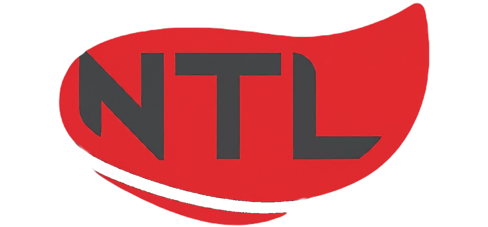

# Next To Last Watches Store

Welcome to the NTL Watches store repository! This repository contains the source code for our fully functional and responsive e-commerce website specializing in luxury watches and jewelry.

## Table of Contents

1. [About](#about)
2. [Features](#features)
3. [Usage](#usage)
4. [Contributing](#contributing)
5. [Security Notice](#security-notice)
6. [License](#license)

## About

NTL Watches is an online platform offering a curated collection of luxury watches and jewelry. Our website provides a seamless shopping experience with a user-friendly interface, showcasing our latest collections and offering convenient account management features.

## Features

- **Responsive Design**: Our website is fully optimized for desktop, tablet, and mobile devices, ensuring a consistent experience across all platforms.
- **Sidebar Navigation**: The sidebar, accessible through the navbar, provides easy access to different sections of the website.
- **Basket Phases**: Our basket follows a structured flow, guiding users through four phases - basket, shipping, payment, and confirmation - for a smooth checkout experience.
- **Interactive Header**: Enjoy a fully functioning watch displayed prominently in the header, allowing users to explore its features and design.
- **Company Information**: Learn more about us, including our headquarters location, office photos, and warehouse details, providing transparency and credibility to our brand.

## Usage

The NTL Watches website is already live and hosted on our servers. You can visit [www.nexttolast.store](https://www.nexttolast.store) to explore the website and its features. If you have any questions or feedback, please contact our customer support team.

## Contributing

For security reasons, access to the backend of the NTL Watches website is restricted. The backend is locked to prevent unauthorized access and ensure the protection of sensitive data. If you would like to review the backend code or have any questions regarding security measures, please contact the owner for access or message us directly for further information.

## Security Notice

Certain components of the NTL Watches website, such as the checkout process and user authentication, are designed with security in mind. We prioritize the protection of user data and adhere to industry best practices for secure web development.

## License

This project is licensed under the GNU Affero General Public License, version 3. See the [LICENSE](LICENSE) file for details.

